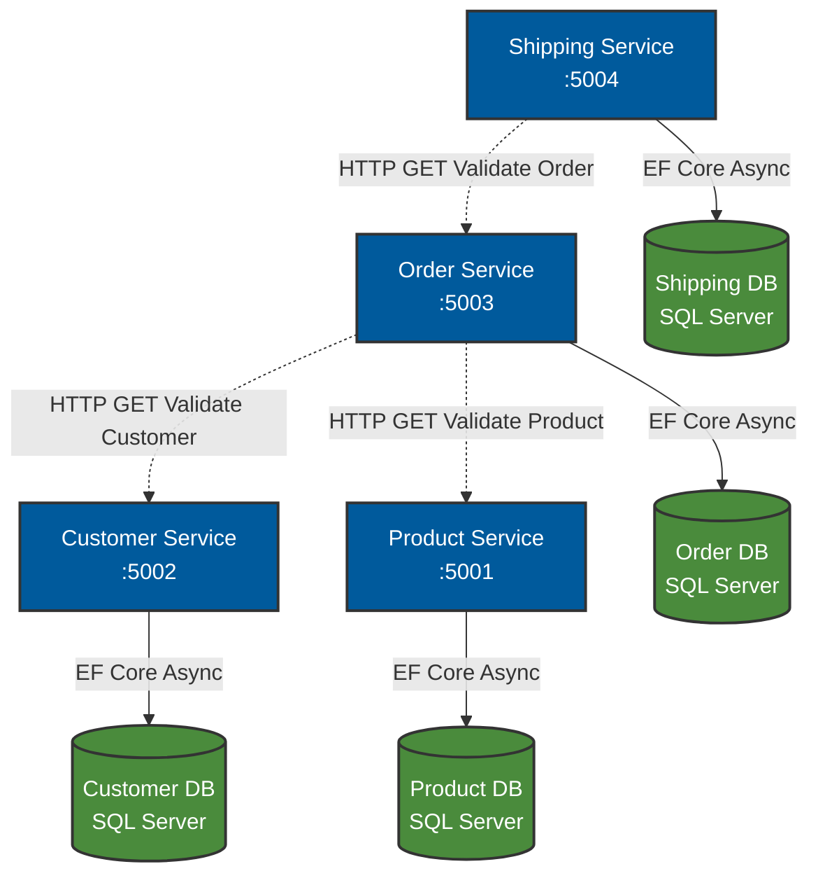

# Midterm Project Report: GoCommerce Backend

## 1. Introduction
This project implements a containerized, distributed backend system for a simplified e-commerce platform, developed to meet the requirements of the Programming for the Internet midterm exam. The system is built using ASP.NET Core Web APIs and utilizes Entity Framework (EF) Core for data access. To ensure scalability and maintain independent deployments, the system adheres to the microservices architecture pattern, heavily utilizing Docker and Docker Compose for orchestration.

As per the strike-through marks in the exam prompt, RabbitMQ and asynchronous event-driven communication were explicitly removed from the scope. Thus, the system relies exclusively on synchronous HTTP communication to establish consistency between the required four services.

## 2. Architecture Diagram

## 3. Data Ownership & Coupling Prevention
A core tenet of microservices architecture is the principle of data sovereignty. In this architecture, **each microservice owns its own data**. 
- **Product Service:** Owns the `Product` entity (Name, Price, Stock).
- **Customer Service:** Owns the `Customer` entity (Name, Email, Address).
- **Order Service:** Owns the `Order` and `OrderItem` entities. It stores references (IDs) to Products and Customers but does not own that data.
- **Shipping Service:** Owns the `Shipment` entity, storing only the reference to an `OrderId`.

This strict separation—enforced by assigning each service its own dedicated SQL Server container and EF `DbContext`—prevents **database integration coupling**. If the `Product Service` schema changes, the `Order Service` does not crash, because they do not share tables. 

However, because services need data from one another, they communicate via APIs. If the `Order Service` needs to know a product's price, it queries the `Product Service` via an HTTP REST call rather than reaching directly into the `ProductDb`.

## 4. Analysis of Eventual Consistency
In a distributed system, maintaining strong ACID (Atomicity, Consistency, Isolation, Durability) transactions across multiple databases is prohibitively slow and creates tight coupling (via Two-Phase Commits). Instead, distributed systems rely on **Eventual Consistency**.

Eventual consistency means that if no new updates are made to a given piece of data, eventually all accesses to that item will return the last updated value. 

### In the Context of this Project
Because RabbitMQ/message brokers were excluded from the scope, the system currently employs **synchronous HTTP calls** during order creation to ensure business rules are met *at that exact moment* (e.g., verifying a customer exists). 

However, because we lack distributed transactions, we still face eventual consistency challenges:
1. **Stock Management:** When an order is placed, the `Order Service` saves the order. Without a distributed transaction or message broker, the `Order Service` cannot guarantee that the `Product Service` decrements the stock quantity simultaneously. If the system were to be expanded, a message broker (like RabbitMQ) would be used to publish an `OrderCreated` event. The `Product Service` would consume this event and update the stock *eventually*.
2. **Data Duplication (Caching):** The `OrderItem` table copies the `ProductName` and `UnitPrice` into its own database. If the `Product Service` later updates a product's price, the historical order retains the old price. This is intentional (orders shouldn't change retroactively) but is a classic example of acknowledging that data duplicated across services is inherently eventually consistent, or represents a snapshot in time.

If asynchronous events (RabbitMQ) were implemented, eventual consistency would be heavily prevalent. An order could be rapidly returning `201 Created` to the user, while the `Shipping Service` and `Product Service` process the downstream effects seconds or minutes later as they process the queue.
