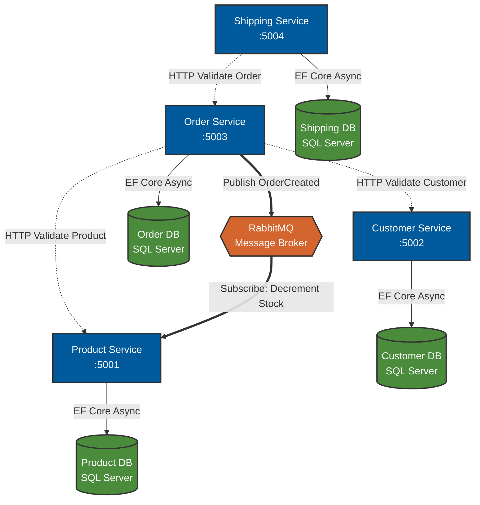
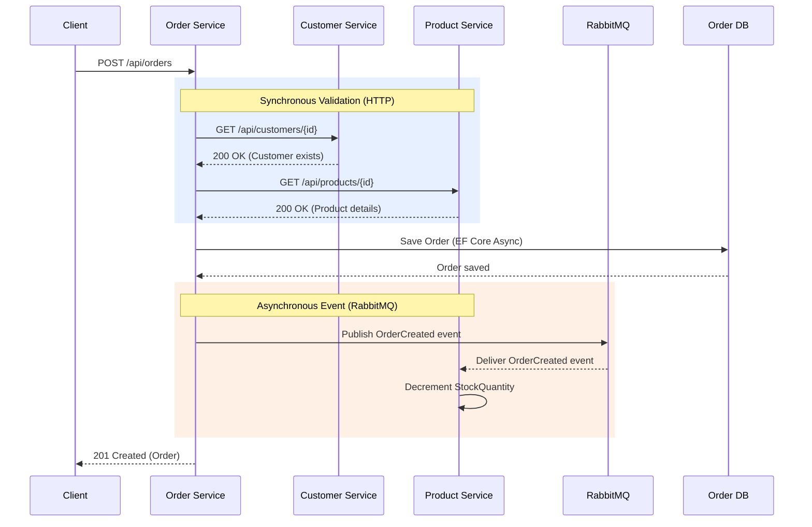
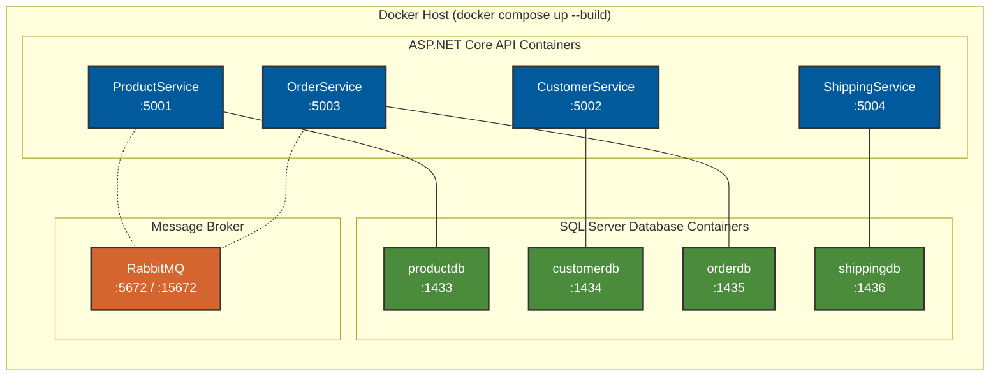

# Midterm Project Report: GoCommerce Backend

## 1. Introduction
This project implements a containerized, distributed backend system for a simplified e-commerce platform, developed to meet the requirements of the Programming for the Internet midterm exam. The system is built using ASP.NET Core Web APIs and utilizes Entity Framework (EF) Core for data access. To ensure scalability and maintain independent deployments, the system adheres to the microservices architecture pattern, heavily utilizing Docker, Docker Compose, and RabbitMQ for orchestration and asynchronous communication.

The system implements both **synchronous HTTP communication** (for real-time validation) and **asynchronous event-driven communication** (via RabbitMQ for stock updates), satisfying the exam's requirements for both communication styles.

## 2. Architecture Diagram

## 2b. Communication Flow

## 2c. Docker Deployment

## 3. Data Ownership & Coupling Prevention
A core tenet of microservices architecture is the principle of data sovereignty. In this architecture, **each microservice owns its own data**. 
- **Product Service:** Owns the `Product` entity (Name, Price, Stock).
- **Customer Service:** Owns the `Customer` entity (Name, Email, Address).
- **Order Service:** Owns the `Order` and `OrderItem` entities. It stores references (IDs) to Products and Customers but does not own that data.
- **Shipping Service:** Owns the `Shipment` entity, storing only the reference to an `OrderId`.

This strict separation—enforced by assigning each service its own dedicated SQL Server container and EF `DbContext`—prevents **database integration coupling**. If the `Product Service` schema changes, the `Order Service` does not crash, because they do not share tables. 

However, because services need data from one another, they communicate via APIs. If the `Order Service` needs to know a product's price, it queries the `Product Service` via an HTTP REST call rather than reaching directly into the `ProductDb`.

### DTO Separation
All services use **Data Transfer Objects (DTOs)** to separate API contracts from internal domain models. Each service has dedicated `DTOs/` directories containing:
- **Request DTOs** (e.g., `CreateCustomerRequest`, `CreateProductRequest`) — define what data the API accepts.
- **Response DTOs** (e.g., `CustomerResponse`, `ProductResponse`) — define what data the API returns.

Domain entities (e.g., `Customer.cs`, `Product.cs`) are never exposed directly through the API. This prevents tight coupling between the API contract and the internal schema, allowing each to evolve independently.

## 4. Inter-Service Communication

### Synchronous Communication (HTTP)
The system uses typed `HttpClient` services for real-time validation:
- **Order Service → Customer Service:** Validates the customer exists before creating an order.
- **Order Service → Product Service:** Retrieves product details (name, price) to build order items.
- **Shipping Service → Order Service:** Validates the order exists before creating a shipment.

### Asynchronous Communication (RabbitMQ)
When an order is successfully created, the `Order Service` publishes an `OrderCreated` event to a RabbitMQ **fanout exchange** (`order_events`). The event contains the order ID and a list of items with their `ProductId` and `Quantity`.

The `Product Service` runs a **BackgroundService** (`OrderCreatedConsumer`) that subscribes to the `product_stock_update` queue bound to the `order_events` exchange. When an event is received, the consumer decrements the `StockQuantity` for each product in the order.

This pattern ensures:
- The `Order Service` does not need to wait for stock updates to complete before responding to the client.
- The `Product Service` processes stock updates independently and asynchronously.
- If the `Product Service` is temporarily unavailable, messages are retained in the queue until it recovers.

## 5. Analysis of Eventual Consistency
In a distributed system, maintaining strong ACID (Atomicity, Consistency, Isolation, Durability) transactions across multiple databases is prohibitively slow and creates tight coupling (via Two-Phase Commits). Instead, distributed systems rely on **Eventual Consistency**.

Eventual consistency means that if no new updates are made to a given piece of data, eventually all accesses to that item will return the last updated value. 

### In the Context of this Project
The system employs **synchronous HTTP calls** during order creation to ensure business rules are met *at that exact moment* (e.g., verifying a customer exists). However, the stock decrement happens **asynchronously** via the RabbitMQ event, meaning:

1. **Stock Management:** When an order is placed, the `Order Service` saves the order and publishes an `OrderCreated` event. The `Product Service` consumes this event and decrements stock *eventually*. There is a brief window where the stock count in the `Product Service` database does not reflect the newly placed order. This is a classic example of eventual consistency.
2. **Data Duplication (Caching):** The `OrderItem` table copies the `ProductName` and `UnitPrice` into its own database. If the `Product Service` later updates a product's price, the historical order retains the old price. This is intentional (orders shouldn't change retroactively) and represents a snapshot in time.
3. **Resilience:** If the `Product Service` is down when an order is created, the event remains in the RabbitMQ queue. When the `Product Service` comes back online, it processes the queued events and catches up—this is eventual consistency in action.
